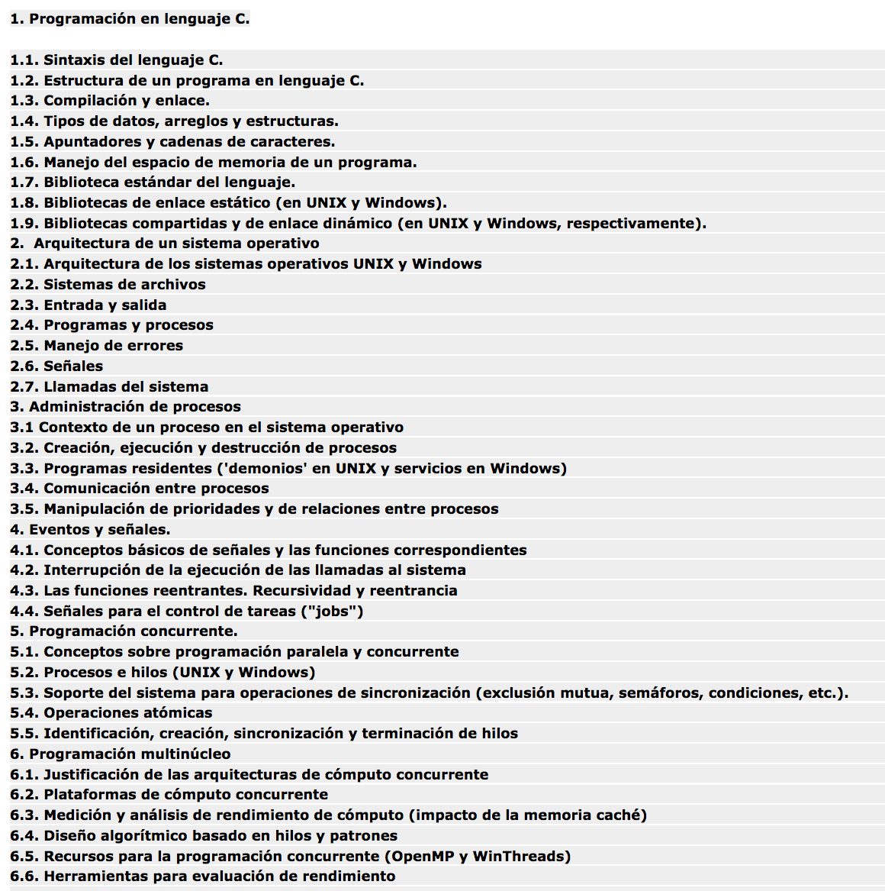

# Programación Avanzada - TC2025
## Temario

## Acerca de
Las [prácticas](https://github.com/Juanca17/advanced-programming/tree/master/practicas) son código hecho en clase: hash, input, threads, semaphores y deamons.  
Las [katas](https://github.com/Juanca17/advanced-programming/tree/master/katas) son problemas de programación cortos que provienen de diferentes sitios como:  
- [Caribbean Online Judge](http://coj.uci.cu/24h/problems.xhtml)
- [Code Chef](https://www.codechef.com/)
- [Codin Game](https://www.codingame.com)
- [Google Code Jam](https://code.google.com/codejam/past-contests)
- [Hacker Rank](https://www.hackerrank.com/dashboard)
- [Leet Code](https://leetcode.com/)

## Lecturas
Lecturas vistas en clase:
- [Lectura 1: control de versiones](https://git-scm.com/book/en/v2/Getting-Started-About-Version-Control)
- [Lectura 2: TDD](https://bit.ly/2sl94pW)
- [Lectura 3: ComplejidadLectura 3](http://discrete.gr/complexity/?en)
- [Lectura 4: 10 basic programmer principles](https://www.makeuseof.com/tag/basic-programming-principles/)
- [Lectura 5.1: About C](https://sites.ualberta.ca/~ygu/courses/geoph624/codes/C.CheatSheet.pdf)
- [Lectura 5.2: Guide to C](https://courses.cs.washington.edu/courses/cse351/14sp/sections/1/Cheatsheet-c.pdf)
- [Lectura 6: 97 cosas que todo programador debe saber](http://programmer.97things.oreilly.com/wiki/index.php/Contributions_Appearing_in_the_Book)
- [Lectura 7: C input and output](https://en.wikipedia.org/wiki/C_file_input/output)
- [Lectura 8: ¿Por qué C?](https://mkdev.me/en/posts/three-reasons-to-learn-c-in-2018)
